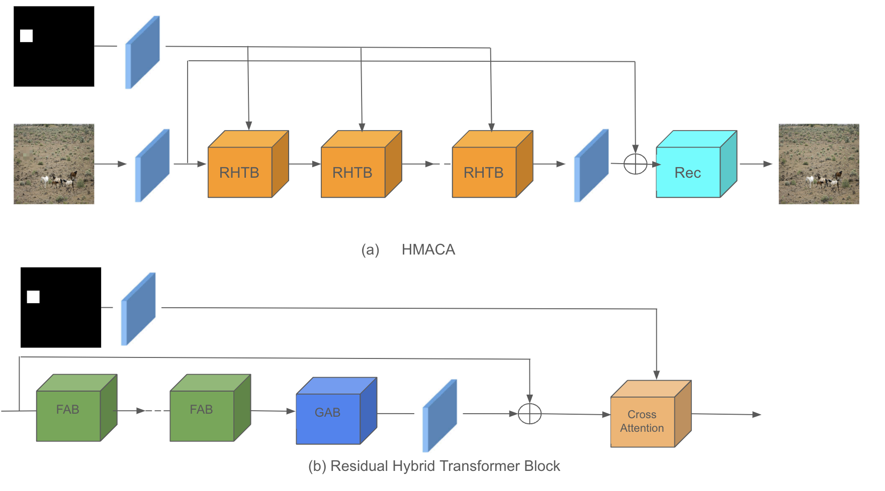
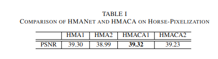
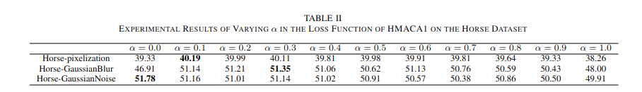
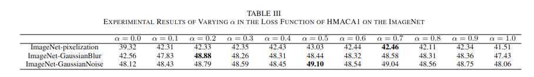
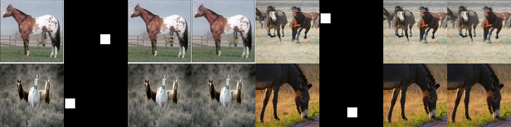

# Enhanced Super-Resolution Using Cross Attention: Refining HMA for Local Image Restoration
This is the official implementation of the paper "Enhanced Super-Resolution Using Cross Attention:
Refining HMA for Local Image Restoration"

## HMACA


## Abstract
In this paper, we propose a novel method that
integrates Cross Attention into the existing Hybrid Multi-Axis
Aggregation Network for Image Super-Resolution(HMANet) to
improve local super-resolution accuracy. While previous HMANet
methods primarily focused on enhancing the resolution of the
entire image, our approach emphasizes local image regions for
more detailed restoration. By leveraging Cross Attention for
context interaction, we achieve localized super-resolution with a
focus on specific parts of the image. Our experiments demonstrate
that the proposed method outperforms existing approaches in
terms of accuracy, and shows promising results when evaluated
with different loss functions.

## Result



### result on Horse-Pixelization

### result on Horse-GaussianBlur

### result on Horse-GaussianNoise


## Environment Installation
```
conda env create -n "ENVIRONMENT NAME" -f hmaca.yml
conda activate "ENVIRONMENT NAME"
```

## Training
```
python train.py
```
## Inference
```
python test.py
```

## References
- https://github.com/korouuuuu/HMA